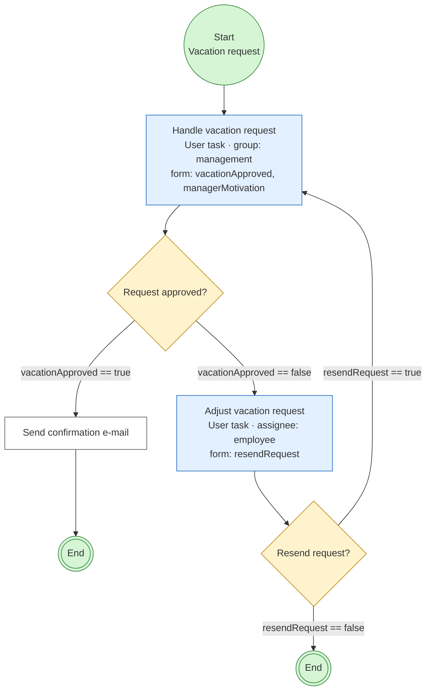

<!-- file generated with AI assistance: Claude Code - 2026-06-18 -->

# Walkthrough: the `vacationRequest` process in the admin UI

A step-by-step run through the classic Flowable **Vacation request** demo
process using the API Platform Admin UI. It demonstrates the bundle's dynamic
per-task form: the form shown before completing a user task is generated from
the BPMN form definition — no form is hand-coded in the frontend.

## What you will see



## Prerequisites

- The stack is running (`docker compose up -d`) and the Flowable engine is
  reachable.
- The `vacationRequest` demo process is deployed (visible under **Flowable →
  FlowProcessDefinition** as *Vacation request*).
- You can sign in to the admin UI.

> **Local-dev defaults** (docker compose): admin UI at `http://localhost:4401`,
> Keycloak at `http://localhost:14405` (realm `demo`), Flowable REST at
> `http://localhost:14408`. Sign-in user `za7-admin` / `test123` (realm role
> `admin`, which inherits `ROLE_FLOWABLE_ADMIN`). Adjust to your environment.

## Steps

### 1. Sign in

Open the admin UI and click **Anmelden mit IDP** / **Sign in**. Authenticate via
Keycloak. Starting and completing tasks requires `ROLE_FLOWABLE_ADMIN`
(`ROLE_ADMIN` inherits it); reading is open to any authenticated user.

### 2. Open the process definition

In the sidebar go to **Flowable → FlowProcessDefinition** and open **Vacation
request**.

### 3. Start an instance

Click **Actions → Start**. A form (`flow_process_definition_start input`)
opens. Either:

- expand **variables** and add the process variables the descriptions use —
  `employeeName` (string), `numberOfDays` (integer), `startDate`,
  `vacationMotivation` — then **Execute**; or
- just **Execute** with an empty body to start with no variables.

On success the response is a `FlowProcessInstance` (status `201`) with an
`@id` such as `/api/flowable/process_instances/<uuid>`. Note the instance id.

### 4. Find the open task

Open the new instance (sidebar **Flowable → FlowProcessInstance**, or follow the
`@id`) and switch to the **FlowTask** tab. It lists exactly the task(s) of this
instance — the open **Handle vacation request** task. Open it.

> The FlowTask tab is scoped to the instance via the relation filter; you only
> see this instance's tasks, not every task in the engine.

### 5. Complete the task — the generated form

On the task, click **Actions → Complete**. The dialog renders a form built
**from the task's BPMN form definition**:

- **Do you approve this vacation** — a dropdown (`vacationApproved`, required).
- **Motivation** — a free-text field (`managerMotivation`).

This form is fetched live from `GET /api/flowable/tasks/{id}/input_schema`
(advertised on the `complete` operation via the `x-input-schema-url` OpenAPI
extension); the bundle derives it from Flowable's form-data. See
[How the form is produced](#how-the-form-is-produced) below.

### 6a. Approve → the process ends

Select **Approve** (`vacationApproved = true`) and click **Execute**
(`204 No Content`). The exclusive gateway takes the *approved* branch →
**Send confirmation e-mail** → end. The instance is finished.

> After completion the task no longer exists; reopening its detail page may show
> a `404` — that is expected, the task is gone.

### 6b. Reject → the adjust loop (alternative)

If you instead select **Reject** (`vacationApproved = false`), the gateway routes
to a new **Adjust vacation request** task assigned to the employee, whose form
has **Resend vacation request to manager?** (`resendRequest`, Yes/No):

- **Yes** → loops back to **Handle vacation request** (step 5).
- **No** → the process ends.

### 7. Verify completion

The approved instance is no longer in the runtime:

- **Flowable → FlowProcessInstance** no longer lists it, and
- its **FlowTask** tab is empty (no open tasks).

## How the form is produced

1. The `complete` operation carries the OpenAPI extension
   `x-input-schema-url: /api/flowable/tasks/{id}/input_schema`.
2. The admin UI, on opening the **Complete** dialog, fetches that URL (with the
   concrete task id) and renders the returned JSON-Schema instead of the static
   request body.
3. The endpoint resolves the schema per task: an authored `<formKey>.schema.json`
   deployment resource wins; otherwise the inline BPMN form definition (returned
   by Flowable's `/form/form-data`) is converted to JSON-Schema on the fly.
4. The fields are wrapped under `variables`, matching the `complete` request
   body, so submitting the form completes the task with those process variables.

`vacationRequest` uses inline `activiti:formProperty` definitions, so its forms
are produced by the on-the-fly converter (no deployment `.schema.json`).

## Troubleshooting

- **`502 Flowable backend error` when completing without the form.** Completing
  *Handle vacation request* without `vacationApproved` leaves the exclusive
  gateway with no matching outgoing flow (it has no default flow) → the engine
  errors. Always provide `vacationApproved` — the generated form makes it a
  required field.
- **Completing from the API/CLI.** The same body works without the UI:

  ```bash
  curl --silent --request POST \
    --header "Authorization: Bearer $TOKEN" \
    --header "Content-Type: application/json" \
    --data '{"variables":{"vacationApproved":"true"}}' \
    "http://localhost:4401/api/flowable/tasks/<task-id>/complete"
  ```

  or via the CLI mirror (acting user required, propagated as the actor):

  ```bash
  bin/console flowable:tasks:complete <task-id> \
    --acting-user <za7-user-uuid> \
    --input '{"variables":{"vacationApproved":"true"}}'
  ```
